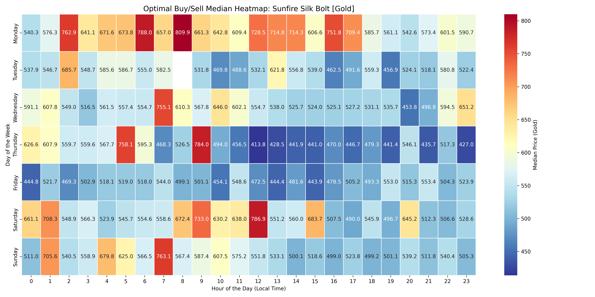
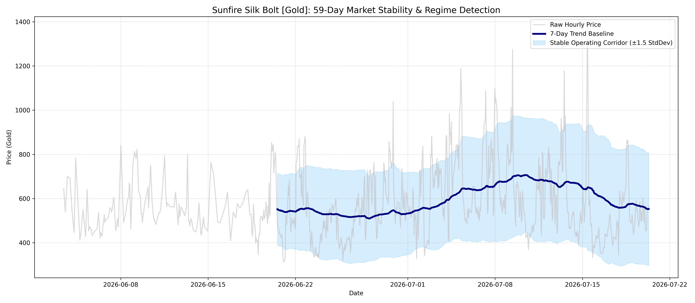

# WoW Auction House: Quantitative Analytics & Algorithmic Arbitrage

An automated quantitative analysis and machine learning pipeline that ingests Blizzard Auction House data, performs seasonality analysis, and trains predictive models to identify high-probability flipping and crafting arbitrage opportunities in a virtual commodity market.

---

## 🚀 Key Project Insights & Portfolio Case Study

### 📊 Case Study: Weekly Seasonality Arbitrage on *Sunfire Silk Bolt [Gold]*
By performing a **168-hour weekly seasonality analysis** on 59 days of continuous historical price observations (430,000+ data points), this project successfully identified a recurring, high-margin market inefficiency on the server:

* **The Trough (Optimal Buy Window)**: **Thursday at 12:00 PM (12:00) Local Time**
  * *Median Price*: **`413.8 Gold`**
  * *Market Driver*: A post-reset mid-week supply dump occurs as crafters flood the market with fresh inventory, creating peak undercutting competition.
* **The Peak (Optimal Sell Window)**: **Monday at 8:00 AM (08:00) / Monday Evening Local Time**
  * *Median Price*: **`809.9 Gold`**
  * *Market Driver*: Supply is fully depleted after a week of active trading, while players rush to complete dungeon and raid lockouts before the weekly reset.
* **Arbitrage Yields**:
  * **Gross Price Increase**: **`+95.7%`**
  * **Net Return on Investment (ROI)**: **`85.9%`** (after accounting for the 5% Blizzard Auction House transaction fee).



---

## 📈 Market Stability & Regime Shift Detection

To ensure trading strategies do not break during expansion content droughts or major patch releases, the pipeline features a **7-Day Rolling Baseline & Control Corridor** ($\pm 1.5$ Standard Deviations):



* **Baseline Tracking**: The thick navy baseline tracks macro-level price inflation/deflation over 2-month periods.
* **Volatility Signals**: Spikes breaking above the control corridor represent **Super-Sell** opportunities, while drops below the corridor trigger **Extraordinary Buy** signals.

---

## 🛠️ Data Science & Modeling Pipeline

### 1. Feature Engineering
Raw observation rows are transformed into a multi-dimensional feature matrix to capture short-term momentum, baseline values, supply metrics, and temporal cycles:
* **Momentum Lags**: $t-1$, $t-2$, and $t-3$ hour lag values to capture immediate price trend velocity.
* **Baseline Reference**: A 24-hour rolling moving average (`rolling_mean_24`) to identify deviations from the daily mean.
* **Supply Metrics**: Total quantity of active listings to evaluate supply-side downward pressure.
* **One-Hot Encoded Calendar Flags**: 
  * Dummy variables for **Days of the week** (baseline: Friday).
  * Dummy variables for **Hours of the day** (baseline: Hour 0).

### 2. The 12-Hour Forecasting Model
A **12-Hour Predictive Model** was trained using Ordinary Least Squares (OLS) regression on an 80/20 chronological Train-Test split:
* **Evaluation Metric (Unseen Data)**: Achieved a **`25.89%` Mean Absolute Percentage Error (MAPE)** and **`192.69 Gold` Mean Absolute Error (MAE)**.
* **Explanatory Power**: Achieved an **`R-squared of 0.298` (29.8%)**, indicating the model successfully isolates nearly 30% of the underlying cyclical weekly trend.
* **Trading Decision Margin**: Establishes a **31% Margin of Safety** threshold (Error + AH Cut) to filter out false signals and ensure profitable real-world executions.

---

## 🖥️ System Architecture & Stack

```
   Blizzard API (OAuth2) 
            │
            ▼
   Python Scraper (Bulk Downloads)
            │
            ▼
   Local SQLite Archive (data/ah_prices.sqlite3)
            │
   ┌────────┴────────┐
   ▼                 ▼
Python/Pandas      Next.js Web UI
(ML & Stats)       (Arbitrage Dashboard)
```

* **Core Language**: Python 3.10
* **Data Engineering & Storage**: SQLite, `uv` Package Manager, Cron (automated scheduling)
* **Statistical Modeling & ML**: Pandas, NumPy, Scikit-learn, Statsmodels
* **Visualization**: Matplotlib, Seaborn
* **Monitoring & Observability**: Discord Webhooks, Preemptive VM Memory/Swap/Disk Watchdog (`check_vm_health.sh`)
* **Deployment**: Hosted on an Oracle Cloud Infrastructure (OCI) VM instance

---

## ⚙️ Setup and Usage

### 1. Install Dependencies
This project uses `uv` for lightning-fast package management.
```bash
make setup
```

### 2. Configure Scraper
Create a `config.json` containing your Blizzard Developer API Credentials and target items:
```bash
cp config.example.json config.json
```

### 3. Run the Pipeline
* **Watchlist Rebuild**: Compile targets from Blizzard's recipe indices:
  ```bash
  make watchlist
  ```
* **Daily Monitor Run**: Scrape, store, and generate predictions:
  ```bash
  make monitor-live
  ```
* **Database Download**: Pull the database from the OCI VM:
  ```bash
  make pull-db
  ```
